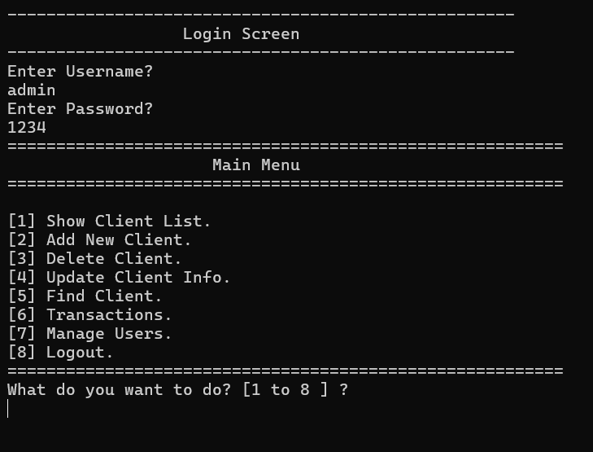
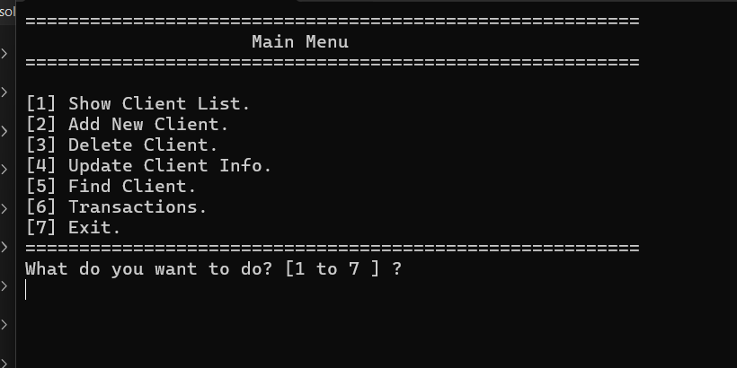
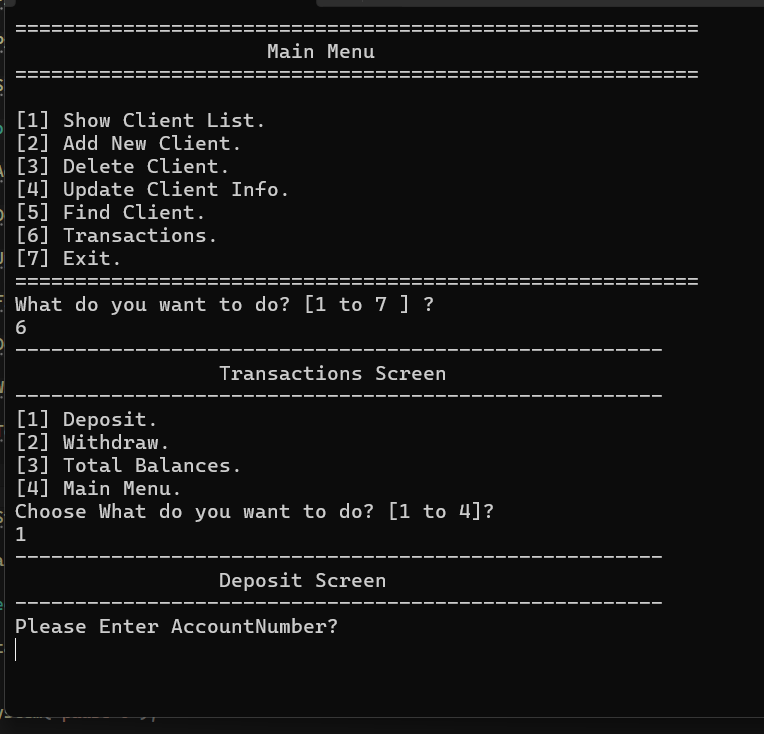
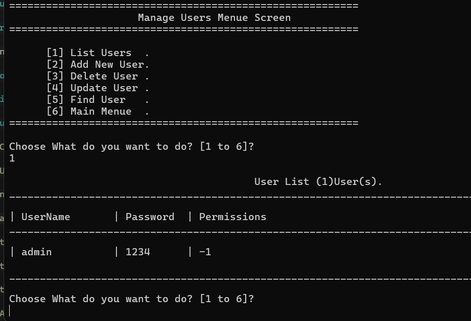
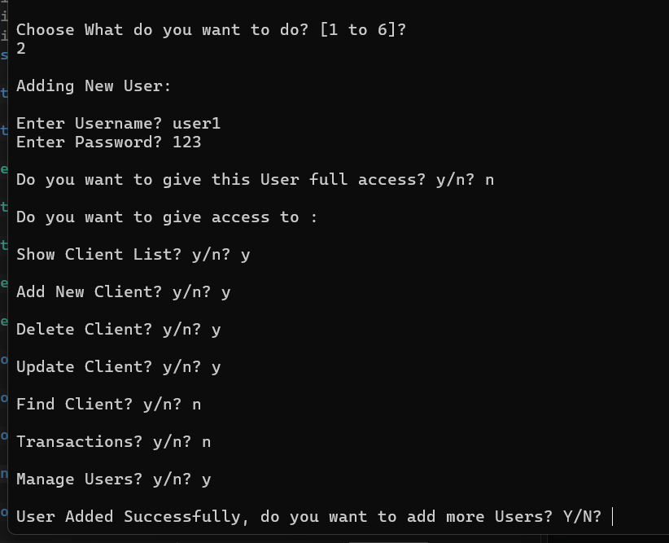

# Bank Management System (C++)

A console-based Bank Management System written in C++. The project provides client account management, banking transactions, user authentication, and a permission-based user management system.

# Authentication

* Username/password login system
* Login loop until valid credentials are entered
* Logout and return to the login screen

# Client Management

* List all clients
* Add a new client
* Delete a client
* Update client information
* Find a client by account number

# Transactions

* Deposit funds
* Withdraw funds
* Prevent withdrawals that exceed the available balance
* View total balances across all clients

#  User Management

* List all users
* Add a new user
* Delete a user
* Update user information
* Find a user by username
* Assign permissions to each user

# Permission System

The system uses a **bitmask-based permission system** to control access to different features.

Each permission is represented by a bit flag:

| Permission       | Value |
| ---------------- | ----: |
| Show Client List |     1 |
| Add New Client   |     2 |
| Delete Client    |     4 |
| Update Client    |     8 |
| Find Client      |    16 |
| Transactions     |    32 |
| Manage Users     |    64 |
| Full Access      |    -1 |

Users can have multiple permissions at the same time by combining the corresponding values.

For example:

```text
permissions = 3
```

## Screenshots

### Login Screen



### Main Menu




### Transactions



### User Management



### Permission System




### User (`stuserinfo`)

| Field         | Type   | Description        |
| ------------- | ------ | ------------------ |
| `username`    | string | Login username     |
| `password`    | string | Login password     |
| `permissions` | int    | Permission bitmask |

---

## Program Flow

1. The program loads client and user data from the text files.
2. The user is asked to log in.
3. After successful authentication, the Main Menu is displayed.
4. The selected operation is checked against the user's permissions.
5. If the user has the required permission, the operation is executed.
6. The user can log out and return to the Login Screen.

### Main Menu

```text
1. Show Client List
2. Add New Client
3. Delete Client
4. Update Client Info
5. Find Client
6. Transactions
7. Manage Users
8. Logout
```

## Requirements

* C++ compiler supporting C++11 or later
* Windows operating system

The project uses Windows-specific commands such as:

```cpp
system("cls");
system("pause>0");
```

## Known Limitations

* Passwords are stored in plain text and are not hashed.
* File parsing assumes that stored records follow the expected format.
* The application currently uses Windows-specific commands.
* There is no automatic first-user setup; the first user must exist in `Users.text`.
* Usernames should be unique.
* `Users.text` and client data files contain application data and should not be committed to a public repository.

---

## Project Structure

```text
Bank-Management-System/
│
├── ConsoleApplication2.cpp.cpp
├── README.md
├── .gitignore
├── myfile.text
├── Users.text
└── screenshots/
    ├── login.png
    ├── main-menu.png
    ├── client-management.png
    ├── transactions.png
    ├── user-management.png
    └── permissions.png